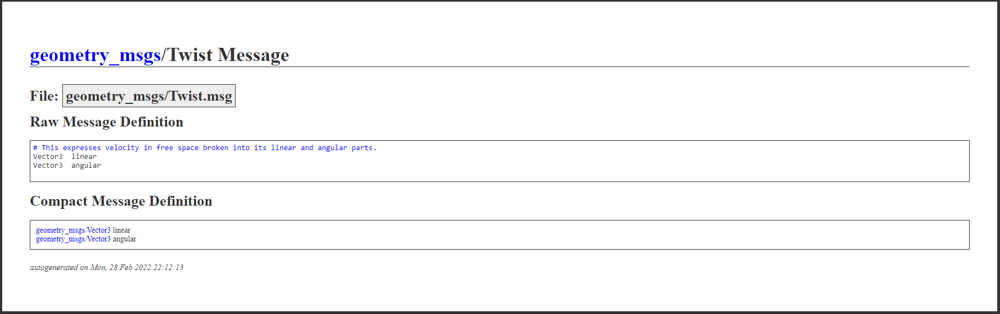
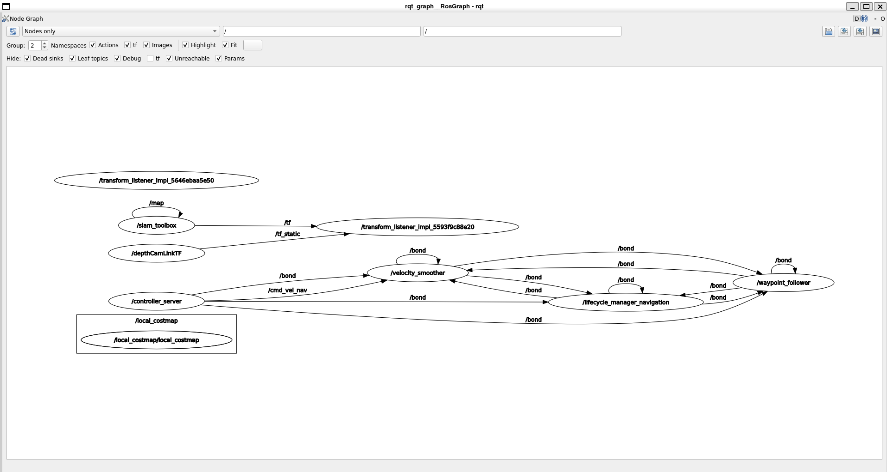

# Day 1 - The beginning, starting from scratch

## Part 1: Playing with the tools

John Vial has created a robotics challenge that sets out the tools and basic information to get a system runnning. Follow the instuction on the [github repository](https://github.com/johnny555/start-creating-robots-email)

## Part 2: Getting a glimpse of what is happening

We will now start looking up what makes up everything ROS2 and how it works starting at the basics. Run the simulation from day 5 again and in another terminal we will look at the nodes and topics that make it up. First run the command below.

```sh
ros2 node list
```

You should see a list of nodes that are currently running as per below.

```sh
/base_fp_linkTF
/behavior_server
/bt_navigator
/bt_navigator_navigate_through_poses_rclcpp_node
/bt_navigator_navigate_to_pose_rclcpp_node
/controller_server
/depthCamLinkTF
/extended_gazebo_bridge
/global_costmap/global_costmap
/lifecycle_manager_navigation
/local_costmap/local_costmap
/planner_server
/robot_state_publisher
/ros_gz_bridge
/rqt_gui_py_node_3264
/rviz
/slam_toolbox
/smoother_server
/transform_listener_impl_5593f9c88e20
/transform_listener_impl_55a7a0e4d4a0
/transform_listener_impl_55df8cdcca50
/transform_listener_impl_560d61d68690
/transform_listener_impl_56257d5730c0
/transform_listener_impl_5646ebaa5e50
/velocity_smoother
/waypoint_follower
```

lets have a closer at one of the individual nodes, run the following command from your terminal.

```sh
ros2 node info /slam_toolbox
```

This command will provide you with some details about the node you are interested in. For SLAM toolbox we can see it has a number of topics that it subscribes to like /lidar and a number of topics that it publishes to like /pose. This information can be a great start to diagnosing issues as you might think that your node should be subscribed to something but it isn't.

```sh
/slam_toolbox
  Subscribers:
    /clock: rosgraph_msgs/msg/Clock
    /lidar: sensor_msgs/msg/LaserScan
    /map: nav_msgs/msg/OccupancyGrid
    /parameter_events: rcl_interfaces/msg/ParameterEvent
    /slam_toolbox/feedback: visualization_msgs/msg/InteractiveMarkerFeedback
  Publishers:
    /map: nav_msgs/msg/OccupancyGrid
    /map_metadata: nav_msgs/msg/MapMetaData
    /parameter_events: rcl_interfaces/msg/ParameterEvent
    /pose: geometry_msgs/msg/PoseWithCovarianceStamped
    /rosout: rcl_interfaces/msg/Log
    /slam_toolbox/graph_visualization: visualization_msgs/msg/MarkerArray
    /slam_toolbox/scan_visualization: sensor_msgs/msg/LaserScan
    /slam_toolbox/update: visualization_msgs/msg/InteractiveMarkerUpdate
    /tf: tf2_msgs/msg/TFMessage
  Service Servers:
    /slam_toolbox/clear_changes: slam_toolbox/srv/Clear
    /slam_toolbox/describe_parameters: rcl_interfaces/srv/DescribeParameters
    /slam_toolbox/deserialize_map: slam_toolbox/srv/DeserializePoseGraph
    /slam_toolbox/dynamic_map: nav_msgs/srv/GetMap
    /slam_toolbox/get_interactive_markers: visualization_msgs/srv/GetInteractiveMarkers
    /slam_toolbox/get_parameter_types: rcl_interfaces/srv/GetParameterTypes
    /slam_toolbox/get_parameters: rcl_interfaces/srv/GetParameters
    /slam_toolbox/list_parameters: rcl_interfaces/srv/ListParameters
    /slam_toolbox/manual_loop_closure: slam_toolbox/srv/LoopClosure
    /slam_toolbox/pause_new_measurements: slam_toolbox/srv/Pause
    /slam_toolbox/save_map: slam_toolbox/srv/SaveMap
    /slam_toolbox/serialize_map: slam_toolbox/srv/SerializePoseGraph
    /slam_toolbox/set_parameters: rcl_interfaces/srv/SetParameters
    /slam_toolbox/set_parameters_atomically: rcl_interfaces/srv/SetParametersAtomically
    /slam_toolbox/toggle_interactive_mode: slam_toolbox/srv/ToggleInteractive
  Service Clients:

  Action Servers:

  Action Clients:
```

Additionally, we can see some of the services that the node is providing, we can call these services at any time from the command line or from another node and we will see how to do this a little later. Finally we can see that it is not running any action servers and isn't a client of any services or action servers currently.

Next we will look at the topics that make up the communications between the nodes.

```sh
ros2 topic list
```

Running this will output a long list of topics.

```sh
/behavior_server/transition_event
/behavior_tree_log
/bond
/bt_navigator/transition_event
/clicked_point
/clock
/cmd_vel
/cmd_vel_nav
/cmd_vel_teleop
/controller_server/transition_event
/cost_cloud
/diagnostics
/evaluation
/global_costmap/costmap
/global_costmap/costmap_raw
/global_costmap/costmap_updates
/global_costmap/footprint
/global_costmap/global_costmap/transition_event
/global_costmap/published_footprint
/goal_pose
/initialpose
/joint_states
/lidar
/lidar/points
/local_costmap/clearing_endpoints
/local_costmap/costmap
/local_costmap/costmap_raw
/local_costmap/costmap_updates
/local_costmap/footprint
/local_costmap/local_costmap/transition_event
/local_costmap/published_footprint
/local_costmap/voxel_grid
/local_plan
/map
/map_metadata
/map_updates
/marker
/odom
...
```

This can be used as a quick check to see if the expected topics are available but it is more useful to echo a topic to see what the current output is. For example if we echo the output of the lidar laser scan we should see the distances to obstacles at each angle from the robot.

```sh
ros2 topic echo /lidar
```

Another topic that might be worth echoing is the /cmd_vel topic. This topic is the standard name in ROS for sending command velocities to control the speed. Try echoing this topic while driving to see it changing over time.

We can look even further into the topic using 

```sh
ros2 topic info /cmd_vel
```

We get the following output

```sh
Type: geometry_msgs/msg/Twist
Publisher count: 8
Subscription count: 1
```

We can then [google](https://letmegooglethat.com/?q=ros2+message+geometry_msgs%2FTwist) the message type and see what makes it up.



For a more wide range view of how the topics are connected to each other we can use an rqt graph. This will give us details on what topics are connected to which nodes as well as other details. Try digging down into the velocity command to see what the base elements of the topics are and try to work out what they physically represent.

```sh
rqt_graph
```



This shows all the nodes and topics currently running and how they are connected. It is a great way to debug a system if you don't know why two nodes aren't talking. 

Now we can view and even read from topics but what if we wanted to send a message to a topic for debugging? Well we can publish messages from the command line as well! Try run the following command and watch what happens to your robot.

```sh
ros2 topic pub /cmd_vel geometry_msgs/msg/Twist "{linear: {x: 2.0, y: 0.0, z: 0.0}, angular: {x: 0.0, y: 0.0, z: 1.8}}"
```

As you can see from this example we specify the message type that is being sent, what topic to send it to and what the values of that message should be. If we only wanted to send a message once we can add the --once tag otherwise it will continue to publish the same message a default interval. To see more with what you can do with this command run:

```sh
ros2 topic -h
```

As mentioned before the system had a number of services available, these are usually requests made to another node to complete some task (i.e. find the euclidean distance between two points). Services are useful so you don't have to have the same code running in every node. If we list the services available in our current system you will see there are many with names you probably won't understand, however if you look at the slam_toolbox section there will be a few that might make sense.

```sh
ros2 service list
...
/slam_toolbox/clear_changes
/slam_toolbox/describe_parameters
/slam_toolbox/deserialize_map
/slam_toolbox/dynamic_map
/slam_toolbox/get_interactive_markers
/slam_toolbox/get_parameter_types
/slam_toolbox/get_parameters
/slam_toolbox/list_parameters
/slam_toolbox/manual_loop_closure
/slam_toolbox/pause_new_measurements
/slam_toolbox/save_map
/slam_toolbox/serialize_map
/slam_toolbox/set_parameters
/slam_toolbox/set_parameters_atomically
/slam_toolbox/toggle_interactive_mode
...
```

We will will call the map saving tool provided by slam toolbox (this is a wrapper to run a different node but works well none the less)

```sh
ros2 service call /slam_toolbox/save_map slam_toolbox/srv/SaveMap "{name: {data: /workspace/mymap}}"
```

Once the service is called you will see the request being sent and a response. If you look in your workspace directory you will also see 2 new files. One is a .pgm file which is a binary version of a grayscale image representing the map and the other file is a .yaml which specifies some parameters for the map (feel free to look into these parameters [here](https://index.ros.org/p/nav2_map_server/)). The map you have just made has been saved and can now be loaded again at a later date.


## Part 3: Simulating a UR5e arm

Now we are going to set up a simulation of the UR5e arms. If you are working in a dev container we will need to build a new docker image to work from using the following Dockerfile:

If you are working on your own ubuntu system then you might want to just install and run this directly without docker.

- Following the instructions here to install ROS2 Jazzy on your ubuntu system [ROS 2 Jazzy](https://docs.ros.org/en/jazzy/Installation/Ubuntu-Install-Debs.html)
- Once installed install the UR5e package for jazzy following the getting started section in [this](https://github.com/UniversalRobots/Universal_Robots_ROS2_Driver) github repo
  - installed using `sudo apt install ros-jazzy-ur`
  - you might need to install docker
    ```
    sudo apt install ca-certificates curl gnupg lsb-release
    sudo mkdir -m 0755 -p /etc/apt/keyrings
    curl -fsSL https://download.docker.com/linux/ubuntu/gpg | sudo gpg --dearmor -o /etc/apt/keyrings/docker.gpg
    echo "deb [arch=$(dpkg --print-architecture) signed-by=/etc/apt/keyrings/docker.gpg] https://download.docker.com/linux/ubuntu $(lsb_release -cs) stable" | sudo tee /etc/apt/sources.list.d/docker.list > /dev/null
    sudo ln -sf /usr/share/keyrings/docker-archive-keyring.gpg /etc/apt/keyrings/docker.gpg
    sudo apt update
    sudo apt install docker-ce docker-ce-cli containerd.io docker-buildx-plugin docker-compose-plugin
    ```

- try running the simuation system using `ros2 run ur_client_library start_ursim.sh -m ur5e`
- Try and get the simulated robot running and move it to the home position using the web portal
- setup the UR5e moveit package and run it
- If you try to run the system now what is the error that comes up?
- Try to activate the missing controller and ensure the ur5e is in the home position.
- Now send trajectory commands using the moveit interaface and confirm that the simulated robot is moving.


That is it for today, the skills you learn here will help with the rest of the week in diagnosing various issues and so on.
