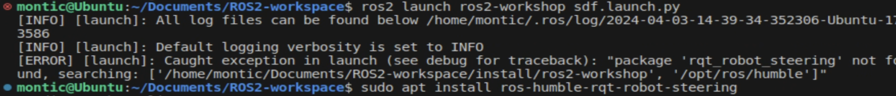
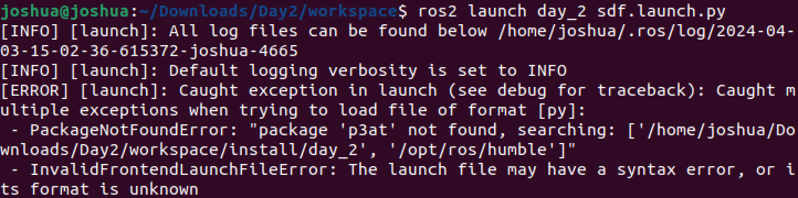

# Day 3: workspace, nodes and comms


Today we will be creating our own workspace from scratch, setting up our simulation environment in a simpler way and writing our own nodes and communication pathways


## Part 1: Setting out the work space and creating a launch file

### Setting it up properly for ROS2

We will now make a new launch file from where the system can be run. Create a new ROS2 workspace on your PC (mkdir for workspace and underneath that folder a second folder called src directory) following the same layout as below (standard ROS folder layout).

```sh
- workspace/
  - src/
    - <packageName>/
      - package.xml
      - CMakeLists.txt (or setup.py)
      - src/ (where you define your nodes)
      - include/ (header files)
      - launch/ (files to launch your application)
      - config/ (yaml and other config files used in nodes and launch files)
      - maps/ (saved maps for driving)
      - models/ (all robot and world model files)
        - meshes/
        - worlds/
        - robots/
      - rviz (config for RVIZ)
  - build/
  - install/ (where you compiled code gets run from)
  - log/
```

Use the following command to build your package, dependencies are optional and not required for this exercise so remove it from your command, remember the <> are an optional name.

```sh
ros2 pkg create --build-type ament_cmake <package_name> <dependencies>
```

After creating your new package you will then need to add some resources from the resource file. First create 5 new folders "launch", "config", "robots", "worlds" and "meshes" and then copy the relevant files from the Resources directory to your new package. You will need to update the file paths again for your new folder arrangement (depending on how you set up your build system you would normally set the file path to the built location but for our purposes just putting it in the src directory is fine)

When a c++ package is building it will look at the CMakeList.txt file to determine how to build everything. At this stage we just want all our files to be added to the install directory so add the following lines to the CMakeList.txt (note for python packages the build setup is different but we won't discuss them at the moment). Needs to be done before ament_package().

```xml
install(
  DIRECTORY launch config meshes robots worlds
  DESTINATION share/${PROJECT_NAME}
)
```

Once you are happy that you have set it up you can use colcon build to build the package. (Instead of building the entire the system after every change we can select just the pacakages that we want to build using "--packages-select <packages>" after the build command.)

```sh
colcon build
```

You might have noticed that the build has failed and if you read the error you will see why.



It says that there is a missing package that we need to add called `rqt_robot_steering`. This package comes from the ros repository, typicially these are `ros_XXX` for example `ros_gz_sim`. To fix this issue the first thing we can do it try to install the package.

```sh
sudo apt install ros-jazzy-rqt-robot-steering
```

You can see that our installs for ros packages always start with `ros-jazzy-` and also note that to find the right package we just add the missing package name and change any _ to -. Try building your system again and see if you get anymore issues, if you do try installing them as per above. At some point you'll come across a package that won't install.



That package is p3at, the error also tells you what paths it has tried searching for the package. At this stage it is hard to know where the error is occuring but start by looking in the launch file as this is where we normally pull in other packages. If you look at line 28 of the sdf.launch.py you will see it is trying to get the shared package p3at, this is the name of my package when I built this file, you need to replace it with the name you gave your package earlier when you created it.

Now we can try launching our system using the launch file we created, first have a look at the launch file and notice what things we are trying to launch including gazebo, rviz2 and a robot state publisher. After viewing run the launch file with the following.

```sh
source install/setup.bash
ros2 launch <package_name> sdf.launch.py
```

You should see gazebo and rviz start up. Again you can check that your gazebo model is working correctly by driving it around and visualising the topics. However in RVIZ, which is the ROS side, you will notice that there are no visuals coming through and that if you echo the `/cmd_topic` there are no velocity commands while using Teleop. This is because we haven't told ROS how to talk to gazebo. For this we need a bridge that connects the two. We will now create this bridge node. Add the following lines under the robot ExecuteProcess section in the launch file.

```xml
  bridge = Node(
    package='ros_gz_bridge',
    executable='parameter_bridge',
    arguments=[
      '/lidar@sensor_msgs/msg/LaserScan@gzition.msgs.LaserScan'
    ,],
    output='screen',
  )
```

This will connect the lidar to the rviz by specifying the topic name we want it to publish on in ROS and the message type (you can find this by googling ros2 message type for lidar). The final part of this line is the message type from gazebo which you can find using:

```sh
gz topic -i --topic /lidar
```

The following message types can be bridged for topics (taken from the [gazebo bridge](https://github.com/gazebosim/ros_gz/blob/ros2/ros_gz_bridge/README.md) repository):

| ROS type                                       | Gazebo Transport Type               |
| ---------------------------------------------- | :------------------------------:    |
| actuator_msgs/msg/Actuators                    | gz.msgs.Actuators                   |
| builtin_interfaces/msg/Time                    | gz.msgs.Time                        |
| geometry_msgs/msg/Point                        | gz.msgs.Vector3d                    |
| geometry_msgs/msg/Pose                         | gz.msgs.Pose                        |
| geometry_msgs/msg/PoseArray                    | gz.msgs.Pose_V                      |
| geometry_msgs/msg/PoseStamped                  | gz.msgs.Pose                        |
| geometry_msgs/msg/PoseWithCovariance           | gz.msgs.PoseWithCovariance          |
| geometry_msgs/msg/PoseWithCovarianceStamped    | gz.msgs.PoseWithCovariance          |
| geometry_msgs/msg/Quaternion                   | gz.msgs.Quaternion                  |
| geometry_msgs/msg/Transform                    | gz.msgs.Pose                        |
| geometry_msgs/msg/TransformStamped             | gz.msgs.Pose                        |
| geometry_msgs/msg/Twist                        | gz.msgs.Twist                       |
| geometry_msgs/msg/TwistStamped                 | gz.msgs.Twist                       |
| geometry_msgs/msg/TwistWithCovariance          | gz.msgs.TwistWithCovariance         |
| geometry_msgs/msg/TwistWithCovarianceStamped   | gz.msgs.TwistWithCovariance         |
| geometry_msgs/msg/Vector3                      | gz.msgs.Vector3d                    |
| geometry_msgs/msg/Wrench                       | gz.msgs.Wrench                      |
| geometry_msgs/msg/WrenchStamped                | gz.msgs.Wrench                      |
| gps_msgs/msg/GPSFix                            | gz.msgs.NavSat                      |
| nav_msgs/msg/Odometry                          | gz.msgs.Odometry                    |
| nav_msgs/msg/Odometry                          | gz.msgs.OdometryWithCovariance      |
| rcl_interfaces/msg/ParameterValue              | gz.msgs.Any                         |
| ros_gz_interfaces/msg/Altimeter                | gz.msgs.Altimeter                   |
| ros_gz_interfaces/msg/Contact                  | gz.msgs.Contact                     |
| ros_gz_interfaces/msg/Contacts                 | gz.msgs.Contacts                    |
| ros_gz_interfaces/msg/Dataframe                | gz.msgs.Dataframe                   |
| ros_gz_interfaces/msg/Entity                   | gz.msgs.Entity                      |
| ros_gz_interfaces/msg/Float32Array             | gz.msgs.Float_V                     |
| ros_gz_interfaces/msg/GuiCamera                | gz.msgs.GUICamera                   |
| ros_gz_interfaces/msg/JointWrench              | gz.msgs.JointWrench                 |
| ros_gz_interfaces/msg/Light                    | gz.msgs.Light                       |
| ros_gz_interfaces/msg/ParamVec                 | gz.msgs.Param                       |
| ros_gz_interfaces/msg/ParamVec                 | gz.msgs.Param_V                     |
| ros_gz_interfaces/msg/SensorNoise              | gz.msgs.SensorNoise                 |
| ros_gz_interfaces/msg/StringVec                | gz.msgs.StringMsg_V                 |
| ros_gz_interfaces/msg/TrackVisual              | gz.msgs.TrackVisual                 |
| ros_gz_interfaces/msg/VideoRecord              | gz.msgs.VideoRecord                 |
| rosgraph_msgs/msg/Clock                        | gz.msgs.Clock                       |
| sensor_msgs/msg/BatteryState                   | gz.msgs.BatteryState                |
| sensor_msgs/msg/CameraInfo                     | gz.msgs.CameraInfo                  |
| sensor_msgs/msg/FluidPressure                  | gz.msgs.FluidPressure               |
| sensor_msgs/msg/Image                          | gz.msgs.Image                       |
| sensor_msgs/msg/Imu                            | gz.msgs.IMU                         |
| sensor_msgs/msg/JointState                     | gz.msgs.Model                       |
| sensor_msgs/msg/Joy                            | gz.msgs.Joy                         |
| sensor_msgs/msg/LaserScan                      | gz.msgs.LaserScan                   |
| sensor_msgs/msg/MagneticField                  | gz.msgs.Magnetometer                |
| sensor_msgs/msg/NavSatFix                      | gz.msgs.NavSat                      |
| sensor_msgs/msg/PointCloud2                    | gz.msgs.PointCloudPacked            |
| std_msgs/msg/Bool                              | gz.msgs.Boolean                     |
| std_msgs/msg/ColorRGBA                         | gz.msgs.Color                       |
| std_msgs/msg/Empty                             | gz.msgs.Empty                       |
| std_msgs/msg/Float32                           | gz.msgs.Float                       |
| std_msgs/msg/Float64                           | gz.msgs.Double                      |
| std_msgs/msg/Header                            | gz.msgs.Header                      |
| std_msgs/msg/Int32                             | gz.msgs.Int32                       |
| std_msgs/msg/String                            | gz.msgs.StringMsg                   |
| std_msgs/msg/UInt32                            | gz.msgs.UInt32                      |
| tf2_msgs/msg/TFMessage                         | gz.msgs.Pose_V                      |
| trajectory_msgs/msg/JointTrajectory            | gz.msgs.JointTrajectory             |
| vision_msgs/msg/Detection2D                    | gz.msgs.AnnotatedAxisAlgzed2DBox   |
| vision_msgs/msg/Detection2DArray               | gz.msgs.AnnotatedAxisAlgzed2DBox_V |
| vision_msgs/msg/Detection3D                    | gz::msgs::AnnotatedOriented3DBox    |
| vision_msgs/msg/Detection3DArray               | gz::msgs::AnnotatedOriented3DBox_V  |

Add the bridge variable to the launch description at the end of the launch file. Try rebuilding (`colcon build`) your package again and the launching it again. In RVIZ add the lidar topic to RVIZ by clicking `Add` on the left and click `By Topic` in the popup menu, you should see a topic there called `/lidar`, add this to RVIZ, you will need to run the simulation and you will notice that it still isn't visible but why is that? This is because ROS2 (and by extension RVIZ) use frame id's and transforms to position everything in the world relative to a fixed frame. In this case we need to select the fixed frame in RVIZ (change it to base_link in the left hand menu) and  update the current frame id for this topic from gazebo so that it has a connection to the base_link. Before ending your simulation save the RVIZ config by going file > save config.

When setting up our system we may run into issues where the components of the robot are not in the place we expect or not showing up as there is no link between the transforms. We can have a look at these transforms using the following command.

```sh
ros2 run tf2_tools view_frames
```

This command listens for transform publishes on the ROS2 network and records them. It will then save these transforms to a pdf which can be viewed. Open up the view_frames file and take a look at the current transforms. You should see the transforms are not connected.

We can also echo a given topic once to see what the frame_id currently is.

```sh
ros2 topic echo /lidar --once
```

scroll to the header in the topic and check the frame_id. Now that we know what the problem is it is time to fix it. There are several ways to fix this, we could publish a static transform in the launch file so there is a link between the two frames however there is a simpler way. Go back to your pioneer urdf and add the following line in under the <sensor> tag.

```xml
<frame>laser_frame</frame>
```

save and rebuild your system and then run it again, you should now see that the lidar comes up when you add it to RVIZ. If you want to view your robot model you can again add it from the `Add` button in the left corner and just click robot model. In the RVIZ menu on the left under robot model there will be an option called Description Topic, select `/robot_description`.

We now need to add in a few more topic to bridge including:

- imu
- camera
- odom
  - this will also require a bridge for the tf2 messages
  - this and the tf2 messages will have a topic name /model/pioneer3at_body/odometry since we didn't define it in gazebo
- cmd_vel

See if you can add these in yourself, with the command velocity and odom you will also need to add in some topic remappings. To do this add the following lines after the `output=` line.

```xml
  remappings=[('/cmd_vel','/cmd_vel'),
    ('/model/pioneer3at_body/odometry','/odom'),
    ('/model/pioneer3at_body/tf','/tf')
  ]
```

Remapping allows you to easily change a nodes subscribing or publishing name so they all line up.

If you are still getting transform errors you might need to add in a static transform between the gazebo footprint and the base footprint

```python
pioneer_base_fp_link_tf = Node(package='tf2_ros', 
                                executable='static_transform_publisher', 
                                name='base_fp_linkTF', 
                                output='log', 
                                arguments=['0.0', '0.0', '0.0', '0.0', '0.0', '0.0',  'pioneer3at_body/base_footprint', 'base_footprint'])
```

<details>
<summary>Example of the final bridge node</summary>
<br>

```python
bridge = Node(
  package='ros_gz_bridge',
  executable='parameter_bridge',
  arguments=['/lidar@sensor_msgs/msg/LaserScan@gzition.msgs.LaserScan',
              '/imu@sensor_msgs/msg/Imu@gzition.msgs.IMU',
              '/model/pioneer3at_body/odometry@nav_msgs/msg/Odometry@gzition.msgs.Odometry',
              '/cmd_vel@geometry_msgs/msg/Twist@gzition.msgs.Twist',
              '/camera@sensor_msgs/msg/Image@gzition.msgs.Image',
              '/model/pioneer3at_body/tf@tf2_msgs/msg/TFMessage@gzition.msgs.Pose_V',
              '/clock@rosgraph_msgs/msg/Clock@gzition.msgs.Clock',],
  output='screen',
  remappings=[('/cmd_vel','/cmd_vel'),
              ('/model/pioneer3at_body/odometry','/odom'),
              ('/model/pioneer3at_body/tf','/tf')
  ]
)
```

</details>

<br>
Now that the robot model is complete and data is coming through we can start working on creating our own nodes and messaging services.

## Part 2: Creating a node with a publisher subscriber

The basic principles behind ROS2 are nodes, which contain your running code, and messaging services, which provide communication between nodes. The simplest communication method is the publisher/subscriber method. You will create a simple node that reads in the Lidar topic /scan and gets the distance to an obstacle from the central beam. You will then republish this on a new topic called /min_front_dist.

To do:
- Create a Node
- Subscribe to the /scan topic
- Look at the laserscan message and work out how to select the central beam
- Publish the distance of the central beam to a new topic
- Add the node to you install file
- Add it to your launch file.


## Part 3: Create a Service

Now that you have your publisher subscriber running it is time to change it up. Now you will create a new node that takes a request to drive until the obstacle infront of it is X metres from the front of the robot using a Service.

To do:
- Create a Node
- Subscribe to the new central beam topic
- Set up a service that takes in a requested number
- Send velocity commands while the distance is greater than X
- Once at the required distance send a response saying complete.
- Add the node to you install file
- Add it to your launch file.

## Part 4: Create and Action

After creating our service we can get the robot to move but we don't know what is happening while we are waiting. We will therefore create another new node that runs an action. As before the request will say how far away the robot needs to be from the wall but while it is driving the robot will give constant feedback on how far it is from the wall.

To do:
- Create a Node
- Subscribe to the new central beam topic
- Set up a service that takes in a requested number
- Send a response saying started
- Send velocity commands while the distance is greater than X
- Provide constant feedback to the user about how far away the wall is
- Once at the required distance send a response saying complete.
- Add the node to you install file
- Add it to your launch file.

## Part 5: Setting up SLAM for mapping

We have seen SLAM toolbox used on Day 1, today we are going to set it up ourselves by connecting the topics to the right places. Start by downloading the [SLAM toolbox](https://github.com/SteveMacenski/slam_toolbox) pacakge.

```sh
sudo apt install ros-humble-slam-toolbox
```

Once installed we will add slam to our launch file, add the following lines to the launch file (remember to change the package name) and add the node to the launch description.

```python
slam_toolbox = Node( 
  package='slam_toolbox', 
  executable='async_slam_toolbox_node', 
  parameters=[
        get_package_share_directory('<package_name>') + '/config/mapping.yaml'
  ], 
  output='screen',
)
```

This time we are loading in a config file using the get_package_share_directory. Have a look at the mapping yaml under the config file and you will see all the configuration settings for SLAM toolbox.

Try running running your launch file again with SLAM toolbox with your current simulation now and view the topics in rqt_graph. What do you notice about the topic connections?

Currently SLAM toolbox is looking for lidar scans on one topic name but the lidar is publishing to a different name. To make this work we need to connect up the LiDAR topics, the naive approach would be to rewrite the nodes so that the topic name from one pacakge lines up with another. The problem with this is that you won't be able to use other peoples packages easily since you don't download the code just the compiled shared library of them. The better approach is to connect the two topics using remapping in the launch file. Go back to your slam toolbox node in your launch file and add the remappings.

For autonomously driving the robot we are going to use the nav2 plugin, this plugin is huge and has many additional features. These can be installed using the follow package.

```sh
sudo apt install ros-jazzy-navigation2 ros-jazzy-nav2-bringup
```

Have a read through the documents and back at john's repo in day 1 to see if you can work out what packages you need to run from your own launch file.